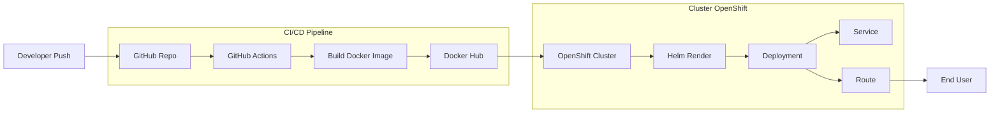

# DevOps App on OpenShift (GitHub Actions + Helm)

This project demonstrates a simple CI/CD pipeline deploying a Python Flask application on OpenShift using Docker, GitHub Actions, and Helm.

---

## Architecture

The pipeline is composed of:

- GitHub repository (source code + Helm chart)
- GitHub Actions (CI/CD)
- Docker Hub (container registry)
- OpenShift cluster (deployment target)
- Helm (templating Kubernetes manifests)

Flow:



---

## Application

Simple Flask application:

- `/` → returns hello message
- `/health` → health check endpoint

---

## Docker

Build image:

```bash
docker build -t myapp:latest .
```

Run locally:

```bash
docker run -p 8080:8080 myapp:latest
```

---

## Project Structure

```text
.
├── app.py
├── Dockerfile
├── helm/
│   └── devops-app/
│       ├── Chart.yaml
│       ├── values.yaml
│       └── templates/
│           ├── deployment.yaml
│           ├── service.yaml
│           └── route.yaml
├── .github/workflows/deploy.yml
```

---

## CI/CD Pipeline

Triggered on push to `main`.

Pipeline steps:

1. Build Docker image
2. Push image to Docker Hub
3. Install OpenShift CLI (`oc`)
4. Install Helm
5. Deploy application to OpenShift using Helm template

---

## Deployment (Helm)

Render and deploy:

```bash
helm template devops-app ./helm/devops-app \
  --set image.repository=andreaepis78/myapp \
  --set image.tag=<commit_sha> \
| oc apply -n andreasandro-dev -f -
```

---

## Requirements

GitHub Secrets required:

- `DOCKER_USER`
- `DOCKER_PASS`
- `OCP_SERVER` (OpenShift API URL)
- `OCP_TOKEN`

---

## OpenShift Resources

The Helm chart deploys:

- Deployment (with probes and resources)
- Service (ClusterIP)
- Route (external access)

---

## Health Check

Application exposes:

- `/` → main endpoint
- `/health` → used by probes

---

## Author

DevOps learning project – OpenShift + GitHub Actions + Helm
```
