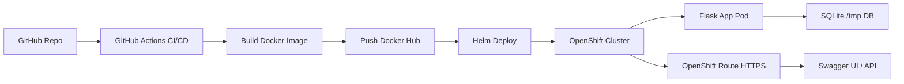

# DevOps CI/CD Microservice on OpenShift (Flask + SQLite + Helm + Swagger)


---

## Context

This project simulates a real-world DevOps scenario where a simple microservice is built, containerized, and deployed on a Kubernetes-based platform using CI/CD practices.

The goal is not just to deploy an application, but to demonstrate a full DevOps lifecycle including automation, observability, and GitOps readiness.

---

## Problem Statement

How can we:

- Deploy a containerized application on Kubernetes/OpenShift
- Automate build and deployment using CI/CD
- Supports environment-based configuration via Helm values, enabling future multi-environment deployments (dev / staging / prod).
- Prepare the system for GitOps adoption
- Expose a simple API with observability endpoints

---

## Architecture Overview

GitHub → GitHub Actions → Docker Hub → Helm → OpenShift → Flask API



---

## Technologies

- Python / Flask
- Flask-RESTX (Swagger UI)
- SQLite (ephemeral storage)
- Docker
- Kubernetes / OpenShift
- Helm
- GitHub Actions CI/CD

---

## Project Structure

```
CI-CD-Microservice-su-OpenShift-with-helm/
│
├── .github/
│   └── workflows/
│       └── deploy.yml
│
├── app/
│   ├── app.py
│   └── requirements.txt
│
├── argocd/
│   └── application.yaml
│
├── helm/
│   └── devops-app/
│       ├── templates/
│       │   ├── deployment.yaml
│       │   ├── service.yaml
│       │   └── route.yaml
│       ├── Chart.yaml
│       └── values.yaml
│
├── Dockerfile
└── README.md
```

---

## Live Application (OpenShift Sandbox)

- API Base: `https://devops-route-andreasandro-dev.apps.rm1.0a51.p1.openshiftapps.com`
- Swagger UI: `/`
- Health: `/health`
- Tasks API: `/tasks`

---

## CI/CD Pipeline

1. Push to `main`
2. GitHub Actions builds Docker image
3. Image pushed to Docker Hub
4. Helm renders Kubernetes manifests
5. OpenShift deploys updated version

---

## GitOps Ready

This project is designed with GitOps principles in mind.

Even though ArgoCD is not installed in OpenShift Sandbox, the repository includes full compatibility.

### GitOps Flow (target architecture)

GitHub → ArgoCD → OpenShift

### Example ArgoCD Application

See: `argocd/application.yaml`

This defines:
- Git as source of truth
- Helm-based deployment
- Automated sync + self-healing

---

## Helm Configuration

The application is fully configurable via Helm values.

This allows deployment customization for different environments (dev, test, prod).

---

## OpenShift Notes

- Designed for OpenShift Sandbox
- No persistent storage (SQLite in `/tmp`)
- Pods may restart periodically
- Ideal for learning / demo purposes

### Authentication

OpenShift authentication is handled via short-lived tokens due to Sandbox security policies.  
Token rotation is managed via GitHub Secrets.

---

## Limitations

- SQLite is not production-ready for distributed systems
- No persistent volume configured
- No real authentication layer
- Sandbox environment constraints

---

## What This Project Demonstrates

✔ CI/CD automation  
✔ Kubernetes deployment using Helm  
✔ Containerization best practices  
✔ GitOps architecture design  
✔ Cloud-native mindset  
✔ Observability endpoints (health, API, Swagger)
