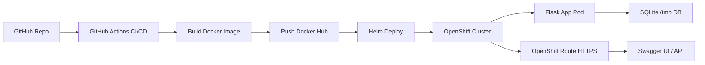

# DevOps CI/CD Microservice on OpenShift (Flask + SQLite + Helm + Swagger)


This project is a complete DevOps pipeline that deploys a Flask microservice on Red Hat OpenShift using GitHub Actions, Docker, and Helm.

It includes a REST API with automatic Swagger/OpenAPI documentation using Flask-RESTX and ephemeral SQLite storage.

---

## Architecture Flow

GitHub Push → GitHub Actions CI/CD → Docker Build → Docker Hub → Helm Deploy → OpenShift Route → Flask API + Swagger UI

---

## Architecture Diagram


---

## Technologies Used

- Python 3 / Flask
- Flask-RESTX (Swagger / OpenAPI)
- SQLite (embedded DB)
- Docker
- Kubernetes / OpenShift
- Helm
- GitHub Actions (CI/CD)
- OpenShift Routes (HTTPS ingress)

---

## Project Structure

```
CI-CD-Microservice/
│
├── app/
│   └── app.py
│
├── helm/
│   └── devops-app/
│       ├── templates/
│       ├── values.yaml
│       └── Chart.yaml
│
├── Dockerfile
├── requirements.txt
└── .github/workflows/deploy.yml
```

---

## Features

- REST API built with Flask
- Automatic Swagger UI (Flask-RESTX)
- SQLite embedded database (no external DB required)
- CRUD endpoints for tasks
- Health check endpoint
- Containerized with Docker
- Deployed on OpenShift via Helm
- CI/CD pipeline using GitHub Actions
- Configurable via Helm values (env-driven)

---

## API Endpoints

### Health check
```
GET /health
```

Response:
```json
{"status": "ok"}
```

---

### Swagger UI (API Documentation)

```
https://<openshift-route>/
```

Automatically generated OpenAPI UI.

---

### Create task

```bash
curl -k -X POST "https://<route>/tasks" \
-H "Content-Type: application/json" \
-d "{\"name\":\"first kubernetes task\"}"
```

Response:
```json
{
  "status": "created"
}
```

---

### Get tasks

```bash
curl -k "https://<route>/tasks"
```

Response:
```json
[
  {
    "id": 1,
    "name": "first kubernetes task"
  }
]
```

---

## 🚀 Deployment Flow

1. Push code to `main`
2. GitHub Actions builds Docker image
3. Image is pushed to Docker Hub
4. Helm deploys application to OpenShift
5. OpenShift Route exposes the service via HTTPS
6. Swagger UI becomes available automatically

---

## Helm Configuration

Example `values.yaml`:

```yaml
replicaCount: 2

image:
  repository: <your-dockerhub>/myapp
  tag: latest

swagger:
  enabled: true
  path: /swagger

resources:
  requests:
    cpu: 100m
    memory: 128Mi
  limits:
    cpu: 250m
    memory: 256Mi
```

---

## OpenShift Sandbox Notes

This project runs on **Red Hat OpenShift Sandbox**, therefore:

- No guaranteed persistent storage
- SQLite database is ephemeral (`/tmp/data.db`)
- Pods may restart at any time
- Designed for learning / DevOps demonstration

---

## Limitations

- SQLite is not suitable for production multi-replica deployments
- Data is lost on pod restart (no persistent volume configured)
- Not designed for high availability

---

## Author

DevOps learning project focused on:

- CI/CD pipelines
- Kubernetes / OpenShift
- Helm packaging
- Microservices architecture
- Swagger/OpenAPI documentation
